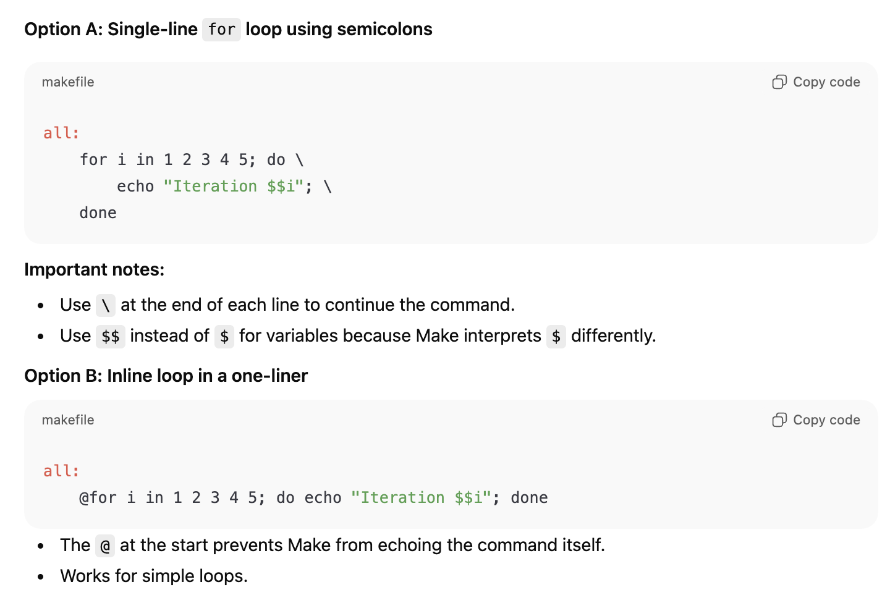

# ECS 034 Project 2:
**Author:**   
**Date:** January 2026

## Description

## Sources

## Generative AI Use:
#### Prompt 1:
prompt: syntax to implement a for loop in markdown makefile
response: 
use: used in Makefile lines 45-47 to run each google test under runtests

## Project Structure

## Build and Test Instructions:

